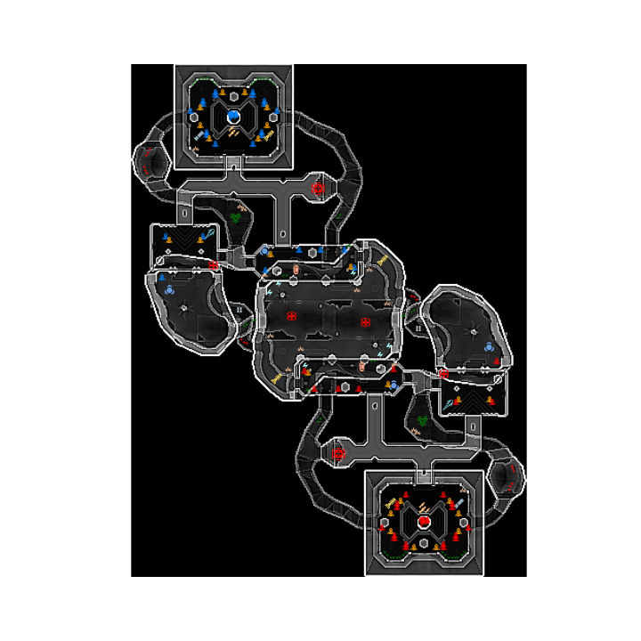

## About these tools

#### maps2json.py

```
usage: maps2json.py [-h] [--add [ADD]] [--all]

Xonotic Map Repository tools help create and manage a map repository.

optional arguments:
  -h, --help            show this help message and exit
  --add [ADD], -a [ADD]
                        Add a package to the repositories JSON
  --all, -A             Add all maps to the repositories JSON. (overwrites
                        existing maps.json)
```

#### chart_json.py

Creates charts for the front-end from the maps.json file.

#### enitities_map.py

A work in progress that superimposes entities onto radar images.



#### get_image_urls.py

An example of extracting data from maps.json and taking an action on it.